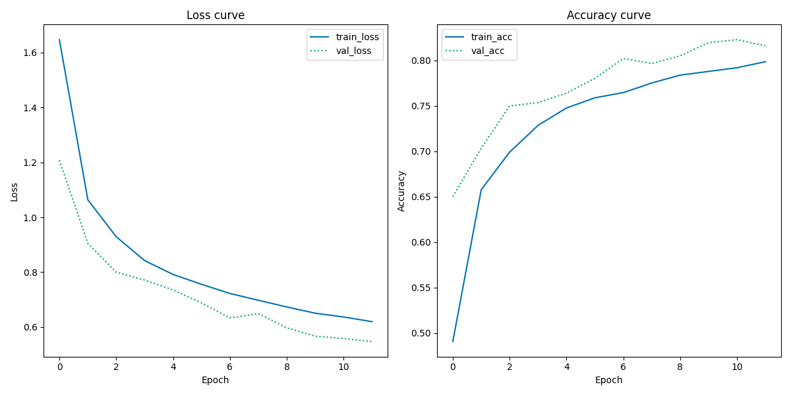

[](https://classroom.github.com/a/Aj7Sf-j_)
[](https://classroom.github.com/online_ide?assignment_repo_id=10866022&assignment_repo_type=AssignmentRepo)

# **Assignment 3 - Using pretrained CNNs for image classification**
## **Cultural Data Science - Visual Analytics** 
#### Author: Rikke Uldbæk (202007501) 
#### Date: 26th of March 2023


# **3.1 GitHub link**
The following link is a link to the GitHub repository of assignment 3 in the course Visual Analytics (F23.147201U023.A). Within the GitHub repository all necessary code are provided to reproduce the results of the assignment.

https://github.com/rikkeuldbaek/assignment3-pretrained-cnns-rikkeuldbaek

<br>

# **3.2 Description**
In this assignment I have worked with the cultural phenomenon *indo fashion*. For this assignment I have written code that trains a *pretrained CNN* on an *indo fashion* dataset in order to classify images of Indian clothing. Furthermore I have saved the classification report and the training and validation history plots in order to evaluate the performance of the classifier. 


<br>

# **3.3 Methods**

### **VGG16**
For this assignment I have used the pretrained CNN (convoloutional neural network) *VGG16*. VGG16 is an algorithm useful for both image classification and feature extraction. In this assignment I have used VGG16 as a feature extraction tool, meaning I have loaded in the convolutional layers and not the final classification network. Then I have added self-designed classification layers to the model and trained the model on a training dataset.  

<br>

### **Data Augmentation**
In this assignment I have also performed data augmentation on the training data. Data augmentation is a technique of modifying the training data artificially in order to increase the training dataset. Using this technique I have made minor changes to the images in the training dataset, for instance I have horizontally flipped, zoomed, and rotated the training images. The reason for this is that one could expect the clothing models in the images to have different postures, and so the position of a clothing item would vary. 


# **3.4 Data**
The *indo fashion* dataset consists of 106K images with 15 unique categories of Indian ethnic clothing. The data comes pre-splitted into a training, validation, and test set. The training set consists of 91166 images, while the validation and test set consists of 7500 each. Within the validation and test set, each of the 15 unique clothing categories consist of 500 samples in order to ensure equal distribution. Due to the fact that the data is around 3GB in size, the data is **not** stored in this repository. Hence, in order to run the code the user must download the data from Kaggle 
([Kaggle dataset](https://www.kaggle.com/datasets/validmodel/indo-fashion-dataset)). Further instructions on where to locate the data in the cloned repositiory and how to setup is provided further below. 

<br>

# **3.5 Repository Structure**
This repository has the following folder structure. 

```bash
.gitignore
README.md
out
   |-- classification_report.txt
   |-- train_val_history_plot.png
requirements.txt
run.sh
setup.sh
src
   |-- data.py
   |-- indo_fash_classification.py
utils
   |-- .keep
   |-- __init__.py
   |-- helper_func.py
```

<br>

The table below presents the required folders and their description and content.

|Folder name|Description|Content|
|---|---|---|
|```src```|model and data scripts|```data.py```, ```indo_fash_classifier.py```|
|```out```|classification reports|```classification_report.txt```, ```train_val_history_plot.png```|
|```data```|please save your downloaded *indo fashion* dataset here| see example below |
|```utils```|helper function for plotting|```helper_func.py```|


The ```data.py```script located in ```src``` loads the .json files from the ```metadata``` folder and converts them to a pandas dataframe. The ```indo_fash_classifier.py``` located in ```src``` preprocess the data, train, fit, and evaluate a model that classifies the *indo fashion* dataset. The ```indo_fash_classifier.py``` produce a classification report (```classification_report.txt```) and a training and validation history plot (```train_val_history_plot.png```) which are saved in the folder ```out```.


<br>

# **3.6 Usage and Reproducibility**
## **3.6.1 Prerequisites** 
In order for the user to be able to run the code, please make sure to have bash and python 3 installed on the used device. The code has been written and tested with Python 3.9.2 on a Linux operating system. In order to run the provided code for this assignment, please follow the instructions below.

<br>

## **3.6.2 Setup Instructions** 
**1) Clone the repository**
```python
git clone https://github.com/rikkeuldbaek/assignment3-pretrained-cnns-rikkeuldbaek
 ```

 **2) Setup** <br>
Setup virtual environment (```VA3_env```) and install packages.
```python
bash setup.sh
```
 
**3) Download the data from Kaggle** <br>
Please download the data from Kaggle ([Kaggle dataset](https://www.kaggle.com/datasets/validmodel/indo-fashion-dataset)), and store it in the ```data``` folder in this repository. You should obtain the following folder structure: 

```bash
data
   |-- images
          |-- metadata
                  |-- test_data.json
                  |-- train_data.json
                  |-- val_data.json
          |-- test
                  |-- 7500 .png files (test images)
          |-- train
                  |-- 91166 .png files (train images)
          |-- val
                  |-- 7500 .png files (validation images)
out
requirements.txt
run.sh
.gitignore
README.md
setup.sh
src
utils
```


<br>

## **3.6.3 Running the scripts** 
The command below will automatically run the ```data.py``` and ```indo_fash_classification.py``` scripts. The command must be executed in the terminal.  
```python
bash run.sh
```

<br>

## **3.6.4) Script arguments**
The classifier have the following default arguments stated below. These arguments can be modified and adjusted in the ```run.sh``` script. If no modifications are added, default parameters are run. In case help is needed, please write --help in continuation of the code below instead of writing an argument.
```python
# run the code
python src/indo_fash_classification.py #add arguments here
```

<br>

The ```indo_fash_classifier.py``` takes the following arguments:
|Argument|Type|Default|
|---|---|---|
|--target_size|int|(224,224) |
|--horizontal_flip|bool|True |
|--shear_range |float |0.2 |
|--zoom_range |float |0.2 |
|--rotation_range |int |20 |
|--rescale_1 |float |1. |
|--rescale_2 |float |255. |
|--batch_size|int |32 |
|--n_epochs |int |12 |
|--class_model |str |"categorical" |
|--pooling |str |"avg" |
|--input_shape|int|(224,224,3)|
|--monitor |str|"val_loss" |
|--patience|int |5 |
|--restore_best_weigths|bool |True |
|--nodes_layer_1 |int | 256|
|--nodes_layer_2 |int |128 |
|--activation_hidden_layer|str |"relu" |
|--activation_output_layer |str |"softmax" |
|--initial_learnig_rate |float |0.01 |
|--decay_steps |int |10000 |
|--decay_rate |float |0.9 |

<br>

The ```data.py``` takes the following arguments:
|Argument|Type|Default|
|---|---|---|
|--sample_size_train |int |16000|
|--sample_size_test|int |4000|
|--sample_size_val|int |4000|
|--target_size|int|(224,224)|

<br>


### **Important to note** <br>
The target_size and the input_shape argument must be specified _without_ commas in the ```run.sh``` script, an example of such:

```python
python src/indo_fash_classifier.py --target_size  224 224 --input_shape 224 224 3
 ```

It is similarly important to note that the ```data.py``` is automatically called upon when running the ```indo_fash_classifier.py``` script, thus the arguments for ```data.py``` must be parsed to the ```indo_fash_classifier.py``` script in ```run.sh```:

````python 
python src/indo_fash_classifier.py --arguments_for_classifier --arguments_for_data
````

Furthermore, my *indo fashion* dataset is located within a different folder structure, i.e., the directory paths in the code varies slightly. Please unquote and insert suggested paths in the ```data.py``` and ```ìndo_fash_classifier.py``` scripts. 

<br>


# **3.7 Disclaimer**
Due to the size of the *indo fashion* dataset, the classifier has not been trained on the entire dataset. It is simply too time consuming, thus the data has been subsetted randomly to the following sample size: 16000 images within the training set and 4000 images within the test and validation set. If the user wants a different split or to increase the sample size please modify the user-specific arguments. 

<br>


# **3.8 Results**

**[Classification report](out/classification_report.txt)** (open link to see) <br>
The model shows an accuracy of 76%. Furthermore, the model seems to be best at classifying *blouses*, *nehru jackets*, *lehenga*, and *mojaris for men* with F1 scores of 90%, 85%, 84%, 84% respectively. 


**Training and validation history plot**



From the Loss Curve plot, the two curves show similar tendencies, i.e., there seems to be a very small difference between the performance of the training and validation dataset. This indicate that there no or little overfitting. Furthermore, the slope of the curves indicate that the performance is not completely stable after 12 epochs, suggesting that the model might be capable of further learning, hence an increase of epochs is recomended in order for the curves to "flatten out" and stabelize. Overall, the Loss Curve plot seems to display learning curves with a descent fit, however it would be ideal if the validation and training loss would reach a point of stability. 

Similairly, the validation and training curves in the Accuracy Curve plot also seems to follow along together pretty nicely. Again, the accuracy seems to not have reached a point of stability, indicating that the accuracy could increase further with more epochs added. 

<br>

## **Resources**

[Tensor Flow](https://www.tensorflow.org/)
<br>
[Tensor Flow - ImageDataGenerator](https://www.tensorflow.org/api_docs/python/tf/keras/preprocessing/image/ImageDataGenerator)
<br>
[Tensor Flow - VGG16](https://www.tensorflow.org/api_docs/python/tf/keras/applications/vgg16/VGG16)
<br>
[Kaggle dataset](https://www.kaggle.com/datasets/validmodel/indo-fashion-dataset)
